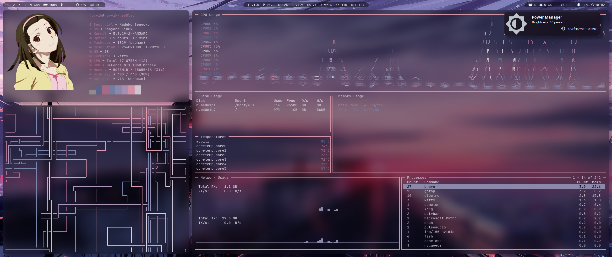
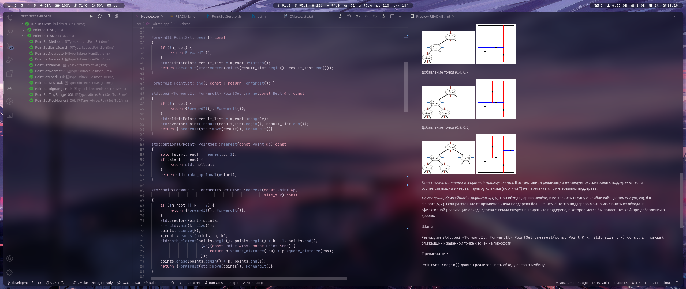

# My dotfiles for arch linux and artix

Rice screenshots are outdated a bit.

## Main packages used

- Terminal emulator: [kitty](https://github.com/kovidgoyal/kitty)
- Editor: [vscode _(official build)_](https://github.com/microsoft/vscode), `visual-studio-code-bin` in AUR
- Distro: arch for desktop, atrix with runit for laptop
- Window manager: [i3-gaps](https://github.com/Airblader/i3)
- Compositor: [picom _(with rounded corners and fancy blur)_](https://github.com/ibhagwan/picom)
- Status bar: [polybar](https://github.com/polybar/polybar)
- Shell: [fish](https://github.com/fish-shell/fish-shell)
  - Plugin manager: [oh-my-fish](https://github.com/oh-my-fish/oh-my-fish)
  - Prompt: [starship](https://github.com/starship/starship)
- Font: [Jetbrains Mono _(with nerd fonts patch)_](https://github.com/JetBrains/JetBrainsMono), `nerd-fonts-jetbrains-mono` in AUR
- Color theme: generated by [pywal](https://github.com/dylanaraps/pywal) from my [wallpaper](Pictures/wallpapers/wall.png)
